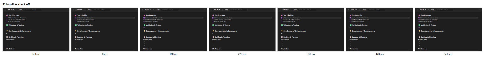
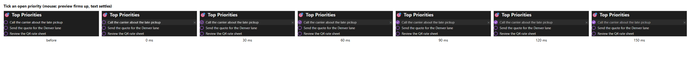

# considered-ux

**A Claude Code skill for interfaces that feel like someone thought about you.**

Ask an AI to build a UI and you get the most probable answer: fade-up on every section, a spinner where the result could have shown instantly, a corner toast for the click you just made, confetti when you tick a to-do. It works, and it would fit any product. Katie Dill (Stripe) calls this **zombie UI**.

considered-ux pushes Claude the other way. Before it designs anything, it asks what you believe about the people using the product. It keeps small details consistent across every screen. Then it spends its liveliness on **one carved moment** per feature, and it doesn't call the motion done until it has looked at recorded frames.

## Before and after

Same app, same prompt ("rework what happens when the user checks off a checklist item, so marking things done feels good"), run once without the skill and once with it. Each strip is a series of screenshots taken as the checkbox is ticked.

**Without the skill.** The row flips from open to done in one step:



**With the skill.** The tick lands within 30 ms and firms up, then the text dims over 150 ms. Everyday motion stays quiet, because this action runs hundreds of times a day:



The carved moment went somewhere else. Ticking the *last* item on a list draws a fine rule under it, left to right, and the rule stays. Finishing a list is the one place the app gets expressive.

## How it works

```
beliefs  →  kit rules  →  one carved moment  →  frames  →  editor pass
```

1. **Beliefs gate.** No design direction until the beliefs are known. If they're missing, the skill interviews you: what do we believe about these people, what should they feel afterward, and what would we never do to them?
2. **Kit rules everywhere.** A kit is a Markdown file of rules, and each rule is tied to a belief:
   > **Answer where they acted.** Feedback appears at the button, caret or row the user acted on, not in a corner toast. *Why: Belief 1.* *Feel: "It answered me right where I was looking."*
3. **Directions for the moment.** It offers 2–3 directions, one of them deliberately weird. Each passes the zombie check ("would a generic model produce this for any similar app?") and names its belief. You pick.
4. **Frames, not vibes.** `scripts/frames.mjs` records each changed interaction as a frame strip, normally and with reduced motion. Claude looks at the strips and fixes what they show before presenting anything.
5. **Editor pass and ledger.** A final critique pass, then the moment is logged in the kit, so the next feature doesn't repeat it.

A **floor** applies to every change, however small: acknowledge input within 100 ms, animate transform and opacity only, never block input, keep focus visible with AA contrast, keep the meaning under reduced motion, and use tokens instead of raw durations.

### In real use

In [Murmur](https://github.com/jshowah-dev/murmur), an offline dictation app written in Rust with egui, the skill carved one moment for the dictionary editor. As you type how a word sounds, the result slides out from under it (`hob → HAWB`), so you can see how the unsaved dictionary will hear you. The frame strips, recorded at 10× slow motion, caught two bugs that the tests missed.

## What you get

| | |
|---|---|
| **Stacks** | Web, Tauri, Angular, egui/Rust. Motion tokens are emitted as CSS or Rust, or mapped onto a repo's existing tokens. |
| **Sizing** | *Touch* for small edits (rules and floor only), *Feature* for the full loop, *Audit* for a ranked list of care gaps and zombie spots |
| **Dial** | `restrained`, `moment` or `full`: how many carved moments, how many directions, and whether sound is allowed |
| **Zombie tells** | 10 banned defaults, each with what to do instead ([`references/zombie-tells.md`](references/zombie-tells.md)) |
| **Frame strips** | Playwright-based, deterministic frame seeking, normal plus reduced motion. There's a native-window capture for desktop apps. |

## More than a prompt file

Most skills are a single `SKILL.md` of instructions. This one uses the rest of the skill format:

| | Typical single-file skill | considered-ux |
|---|---|---|
| **Instructions** | Everything in one file, loaded every time | A short `SKILL.md` that points to `references/`, read only at the step that needs them |
| **Memory** | None; each run starts from scratch | **Kits** hold your beliefs, rules and a ledger of past moments. Claude reads and writes them, so one feature shapes the next. |
| **Tools** | Claude improvises | **Scripts** for what Claude does badly by hand: checking kits, emitting tokens, recording frames |
| **Checking its own work** | Claude says it's done | **Frame strips.** Claude can't watch an animation, but it can look at eight screenshots of one. |
| **Tests** | Rarely | 48 unit tests, plus scenarios run with and without the skill |

Separating the method (`SKILL.md`) from the taste (a kit) is what makes it forkable: write your own kit and you get *your* style, not mine. The cost is weight. It needs Node, Playwright and Chromium, where a single-file skill runs with nothing installed.

## Install

In Claude Code (2.1.275 or later):

```
/plugin install considered-ux --marketplace jshowah-dev/considered-ux
```

Claude Code installs the Node packages with the plugin. Chromium (about 150 MB) is only needed for frame strips; the first time one is needed, the skill prints the one command that installs it. Node must be on your PATH.

Claude Code picks the skill up for UI work, or you can ask directly: "give this a UX pass".

<details>
<summary>Manual install, to edit the skill</summary>

```bash
git clone https://github.com/jshowah-dev/considered-ux ~/.claude/skills/considered-ux
cd ~/.claude/skills/considered-ux
npm install
npx playwright install chromium
```

Don't install the plugin as well, or the skill loads twice.
</details>

## Make your own kit

[`kits/jeff.md`](kits/jeff.md) is a real kit: 3 beliefs, 9 rules, products and a ledger. For your own product family, copy [`kits/_template.md`](kits/_template.md) to `~/.claude/considered-ux/kits/<family>.md` and [`kits/_template.tokens.json`](kits/_template.tokens.json) to `~/.claude/considered-ux/kits/<family>.tokens.json` (starting timings; tune them to taste). The skill runs the belief interview the first time. Then ask Claude to check the kit, or run `scripts/kit.mjs --check <kit.md>` from the skill folder.

Kits in `~/.claude/considered-ux/kits/` are read before the bundled ones and live outside the skill folder, so a plugin update never touches them and they never enter this repo's history. In a work repo, the skill never writes its own name, the kit or AI into the code.

## Evidence

Three scenarios, each run by a fresh agent with the same prompt, once without the skill and once with it, and scored against the diffs, frame strips and transcripts:

| Scenario | Without | With |
|---|---|---|
| S1: planner check-off | 0/6 | 6/6 |
| S2: freight-quote review audit | 1/4 | 4/4 |
| S3: save button, no kit | 2/4 | 4/4 |

In a blind side-by-side, I picked the skill's version, but narrowly. The difference is in feel, not in screenshots, which is why frame strips exist. The prompts, transcripts and results are in [`tests/`](tests/).

## Repo layout

| Path | Purpose |
|---|---|
| `SKILL.md` | The skill itself: kit and beliefs gate, sizing, feature loop, dial, floor, red flags |
| `references/` | Craft notes, editor pass, zombie tells, per-stack token guidance |
| `kits/` | The template and one real kit |
| `scripts/` | `kit.mjs` (parse and check kits), `emit-tokens.mjs` (CSS/Rust tokens), `frames.mjs` / `frames-native.ps1` (frame strips) |
| `tests/` | 48 unit tests (`npm test`), scenarios, baselines and results |

For palette and font choices when a project has none, the skill can use [ui-ux-pro-max](https://github.com/nextlevelbuilder/ui-ux-pro-max-skill). It's optional.

## Credit

"Zombie UI", and the idea that craft shows in the details users feel rather than see, come from Katie Dill's talk [*Raise the ceiling*](https://www.youtube.com/watch?v=GLvFTMtw4Jk) (Lenny & Friends Summit).

## License

MIT
